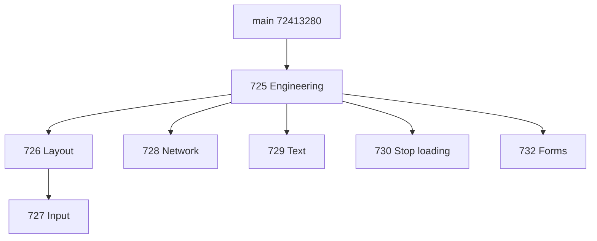

# PR 640 split and acceptance ownership

Original [PR #640](https://github.com/lexmount/moli/pull/640) and branch `codex/browser-eval-root-causes` remain at `ad0df2276d10e8f933f0216c30199229c6146b2e`.

The split is based on main `7241328085c8fdf0e18cbd6a2ef4d0eec878efb5`. Layout, network, text, stop-loading and forms use the engineering foundation as their direct base. Input depends on layout: its click preflight needs geometry invalidation after DOM and style changes. Each feature diff is shown against its direct prerequisite and has its own CI. [Input dependency evidence](input-layout-dependency.json) records the unchanged input patch across the rebase.

| PR | Responsibility | Functional case ownership |
|---|---|---|
| [#725](https://github.com/lexmount/moli/pull/725) | Diagnostics and portable test infrastructure | Specialized contracts |
| [#726](https://github.com/lexmount/moli/pull/726) | Layout and geometry | 28 |
| [#727](https://github.com/lexmount/moli/pull/727) | Input activation and navigation lifecycle | 274, 386, 465, 731 |
| [#728](https://github.com/lexmount/moli/pull/728) | Network metadata and durable response evidence | 339, 676 |
| [#729](https://github.com/lexmount/moli/pull/729) | Text and JSON documents | 784 |
| [#730](https://github.com/lexmount/moli/pull/730) | Stop loading while preserving committed content | Specialized contracts |
| [#732](https://github.com/lexmount/moli/pull/732) | Live form named properties | Specialized contracts |

The original 11 categories are preserved in [the historical scope](historical-failure-scope.json). The raw failure union for official 1.1.8 and 1.1.9 contains 36 cases. The 35 functional acceptance cases are the original 1.1.9 failures plus 386. Case 67 is retained as historical transport-timeout evidence, not counted as a browser repair; the report's later paired reads succeeded for both the old and modified browser.

Case ownership is an acceptance responsibility, not a claim that an independently split head has already passed it. Existing combined-version results are not transferred to individual PRs. Current head gates are run by each PR's CI; any further replay validation is restricted to the historical failure scope rather than the complete 90-case cohort.

The [engineering evidence](engineering-22e161c8/README.md) records 18,416 passing Rust tests, 13 passing CI-script tests, and the release diagnostic-pipe red/green check, with explicit pre/post-rebase provenance. [The original test-name audit](source-test-changes.json) maps six renamed/reworked tests to their retained replacements.
