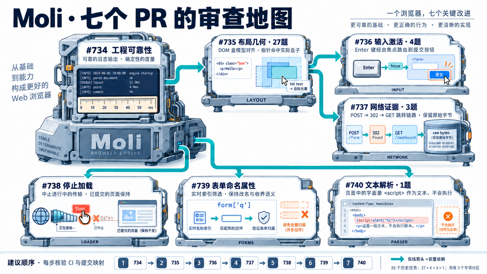
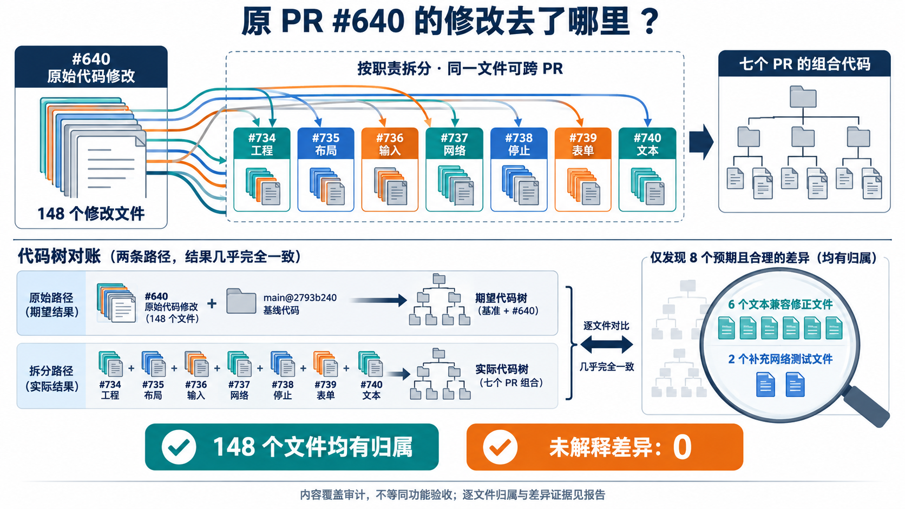
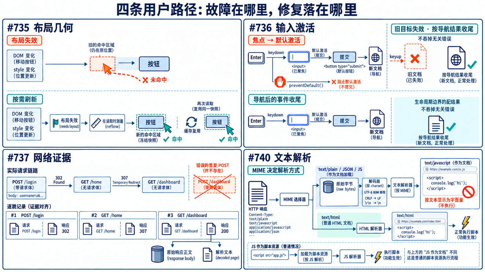
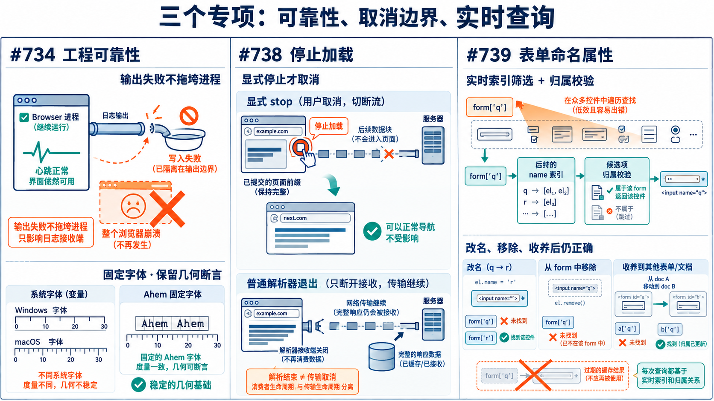
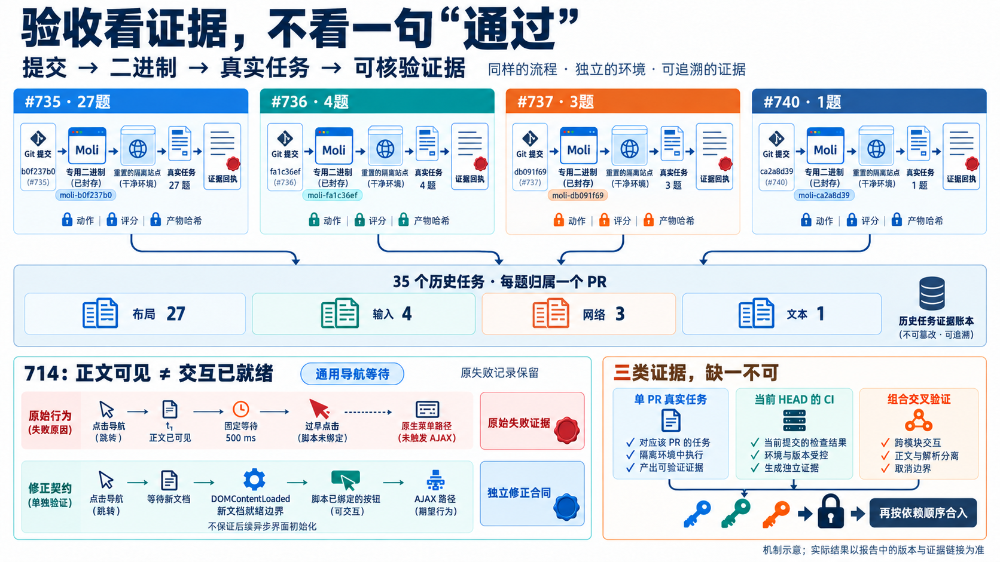

# PR #640 拆分审查指南

七个独立职责的 PR；按依赖阅读机制，再核对精确版本的验证证据。

审查与合入顺序：734 → 735 → 736 → 737 → 738 → 739 → 740。该顺序不是线性依赖链：734→735→{736,737}；734→{738,739,740}。

图为机制示意，非实测截图。

## [734 · 工程与验证基础](https://github.com/lexmount/moli/pull/734)

stderr 被关闭时，记录脚本错误可能中止浏览器。

修复：使用 tracing 标准配置关闭日志组件自身失败的二次输出；固定跨平台夹具与归档校验。

Review：正常日志是否保留？测试是否仍验证真实请求、几何与数据库语义？

不认领 35 题；诊断管道与工程契约由专项测试覆盖。

HEAD：`2e9c28529fb45a22d01b1888d1e0d314cd9dc068`  
直接 base：`2793b2407fc7805afcb531e94fc02da4ac7bf33d`（main）

Format：SUCCESS；Clippy：SUCCESS；Nextest：SUCCESS。全部检查中仍有 5 项未完成、0 项失败。

## [735 · 几何与按需布局](https://github.com/lexmount/moli/pull/735)

DOM 已更新，元素仍返回零面积或旧位置。

修复：在所属模块标记失效；精确几何读取刷新并冻结快照，修复 inline 片段与包含块语义。

Review：DOM、样式、字体和视口是否完整使快照失效？干净读取是否复用？默认 Mock 是否仍按需布局？

原冻结合同：26/27 通过；714 失败，原始记录保留。

HEAD：`b0f237b0955784c12a22bdda3996f52a8610f4cd`  
直接 base：`2e9c28529fb45a22d01b1888d1e0d314cd9dc068`（codex/pr640-reliability-final）

Format：SUCCESS；Clippy：SUCCESS；Nextest：SUCCESS。全部检查中仍有 4 项未完成、0 项失败。

## [736 · 输入与默认激活](https://github.com/lexmount/moli/pull/736)

Enter 未提交；导航后的输入收尾被当成失败。

修复：核心输入共享焦点与默认激活，协议边界使用明确类型；点击预检读取当前布局。

Review：preventDefault、遮挡和跨 frame 是否保持语义？是否只处理导航所属的收尾错误？

原冻结合同：4/4 通过。

HEAD：`fa1c36ef558cde8751883bff174dac7417395220`  
直接 base：`b0f237b0955784c12a22bdda3996f52a8610f4cd`（codex/pr640-layout-final）

Format：SUCCESS；Clippy：SUCCESS；Nextest：SUCCESS。全部检查中仍有 5 项未完成、0 项失败。

## [737 · 网络观察与响应证据](https://github.com/lexmount/moli/pull/737)

实际请求成功，CDP 记录却缺少请求头或重定向元数据。

修复：按传输结果记录请求；共享逐跳方法/正文规则；有界所有者统一响应体与索引。

Review：ExtraInfo 是否与真实 wire 一致？302 后307是否保留正确方法？预算、会话隔离与导航保留是否同步？

原冻结合同：2/3 通过；676 失败，保留原始产物。

HEAD：`db091f6976d3742a669b64c85360d4dfd3e41ca6`  
直接 base：`b0f237b0955784c12a22bdda3996f52a8610f4cd`（codex/pr640-layout-final）

Format：SUCCESS；Clippy：SUCCESS；Nextest：SUCCESS。全部检查中仍有 0 项未完成、0 项失败。

## [738 · 停止加载与生命周期](https://github.com/lexmount/moli/pull/738)

停止加载可能清空已提交内容，或让迟到任务污染新页面。

修复：取消归属明确的导航/传输任务；区分提交前后，保留已解析 DOM 并收拢 load gate。

Review：停止是否幂等？旧回调能否影响新导航？解析器退役是否被误当成网络取消？

不认领 35 题；提交前后取消、held socket 与后续导航采用专项契约。

HEAD：`b43a213dc6b68a314dadcdf36d3b5fb4dc8d8d3b`  
直接 base：`2e9c28529fb45a22d01b1888d1e0d314cd9dc068`（codex/pr640-reliability-final）

Format：SUCCESS；Clippy：SUCCESS；Nextest：SUCCESS。全部检查中仍有 3 项未完成、0 项失败。

## [739 · 表单命名属性](https://github.com/lexmount/moli/pull/739)

不存在的命名属性反复扫描控件，优化又可能产生过期答案。

修复：用实时名称索引筛选候选，命中后验证所属表单；不缓存最终查询结果。

Review：改名、归属变更与跨文档收养是否立即生效？getter、枚举和标准属性是否被意外触发？

不认领 35 题；命名语义与扫描计数正反对照由专项测试覆盖。

HEAD：`7919ed092465dd2e8c288201bde5aa7d7f71ad2c`  
直接 base：`2e9c28529fb45a22d01b1888d1e0d314cd9dc068`（codex/pr640-reliability-final）

Format：SUCCESS；Clippy：SUCCESS；Nextest：SUCCESS。全部检查中仍有 2 项未完成、0 项失败。

## [740 · 文本响应解析](https://github.com/lexmount/moli/pull/740)

JSON 被当作 HTML；子文档可能重复包装、转义并触发副作用。

修复：主文档与子文档共享文本初始化和流式解析；声明 MIME 优先，单个 pre、无 doctype、标准模式。

Review：编码与分块是否改变正文？快照与 live DOM 是否一致？伪 HTML 是否仍是字面文本、没有脚本或预加载？

原冻结合同：1/1 通过。

HEAD：`ca2a8d39572644de1211e3aba30d239abf0ffb17`  
直接 base：`2e9c28529fb45a22d01b1888d1e0d314cd9dc068`（codex/pr640-reliability-final）

Format：SUCCESS；Clippy：SUCCESS；Nextest：SUCCESS。全部检查中仍有 4 项未完成、0 项失败。

## 35 题与原 11 类问题

595 最终归网络；386 为 1.1.8 历史补充。第 7、9 类保留观察，不重复计入 35 题。

### 1 · 目标元素布局面积为零

29 → #735, 108 → #735, 156 → #735, 163 → #735, 196 → #735, 374 → #735, 389 → #735, 399 → #735, 415 → #735, 418 → #735, 441 → #735, 448 → #735, 506 → #735, 585 → #735, 590 → #735, 658 → #735, 666 → #735, 714 → #735

### 2 · 版块链接宽度为零

66 → #735, 404 → #735, 595 → #737, 620 → #735, 640 → #735, 645 → #735

### 3 · 零宽链接改变可见元素序号

314 → #735, 349 → #735

### 4 · 用户建议项的几何状态未更新

576 → #735

### 5 · 配置向导的几何状态未更新

547 → #735

### 6 · 按键与导航生命周期冲突

274 → #736, 465 → #736, 386 → #736

### 7 · 禁用控件的就绪竞态

仅观察，不计入 35 题。

### 8 · Enter 未产生搜索提交

731 → #736

### 9 · 正文请求传输超时

仅观察，不计入 35 题。

### 10 · 网络记录缺少验收所需 Referer

339 → #737, 676 → #737

### 11 · JSON 页面缺少预期文本节点

784 → #740

## 原 #640 内容是否遗漏

原148文件全部承接；当前main对齐后142文件完全保留、6个文本兼容改写。全树仅8文件差异：6兼容文件与2网络补测文件。原新增131个命名测试保留，6项旧测试更名承接，15个共享文件关键hunk已核对。

[完整审计与148文件明细](evidence/final-original640-coverage-audit.md) · [测试与hunk机器可核对证据](evidence/final-original640-coverage-audit.json) · [七分区patch-id复核](evidence/final-rebase-provenance-rechecked.json)

内容覆盖不等于35题全部通过，原合同失败结果保留。

## 合入与版本证据

按 734 → 735 → 736 → 737 → 738 → 739 → 740 合入。父 PR 线性合入后，仅重放子 PR 自身直接 base → HEAD 增量到最新 main，再复核 diff、提交身份与 CI。保留原始 PR、分支和已测试提交证据；旧二进制结果不能直接换成新 HEAD 标签。

## 架构与 Rust 审查依据

[仓库架构](https://github.com/lexmount/moli/blob/2793b2407fc7805afcb531e94fc02da4ac7bf33d/README.md)：native DOM / Stylo 单一状态来源，布局按需快照；检查失效归属、快照一致性与默认 Mock 行为。

[Rust 类型安全](https://rust-lang.github.io/api-guidelines/type-safety.html)：状态和所需数据由类型表达；[Rust 错误处理](https://doc.rust-lang.org/book/ch09-03-to-panic-or-not-to-panic.html)：区分可恢复错误与不变量破坏，不能以导航为由吞掉无关错误。

[Rust Style Guide](https://doc.rust-lang.org/stable/style-guide/) 与 [仓库门禁](https://github.com/lexmount/moli/blob/2793b2407fc7805afcb531e94fc02da4ac7bf33d/AGENTS.md) 确定格式和检查要求；门禁不能替代生命周期、真实 wire 与 DOM/raw body 的独立验证。

## 机制图解

## 验收合同

最终验收采用原执行器已有的只读就绪前提；原动作、评分与二进制保持不变。该合同的布局验收尚未完成，原合同 26/27 保留。 已放弃的全局等待实验：20/27 通过；其新增 5 秒等待预算造成额外超时，不用于最终验收。原始失败记录保留。 已放弃实验的完整审计

组合版本 ed844e7c 的 localhost HTTP + CDP 场景 3/3 通过：文本 DOM 与原始网络正文、停止后新导航、解析器退役后继续捕获响应。该结果属于七分区组合，不能代替各 PR 或 35 题成绩。 组合场景证据

676 Chrome / Moli 时序证据 加入 676 就绪前提的后续完整三题验收为 2/3：339、676 通过，595 在脚本初始化前触发原生订阅表单，仍失败；该结果不与原轮拼接为 3/3。 后续三题审计 网络显式就绪合同 v2 已完成 3/3；595 与 676 有独立验证的就绪前提，其余动作与评分不变。 完整3题新合同审计

文本 PR 的 Nextest 汇总包含 1 个重试后通过的测试；现有 CI 配置未保留该测试名称与首次失败输出，不能把它描述为全部首轮通过。

[Nextest 重试证据审计](evidence/text-nextest-flaky-audit.md)

[已放弃的全局等待实验及独立验证](https://github.com/lexmount/moli/blob/927ff985989594b4ddced962add6b59e492de6eb/docs/pr640-evidence/verification/navigation-ready-validation.md)

所有插图均为机制示意，非实测截图。原合同结果保持不变；新合同结果不与其合并计分。
